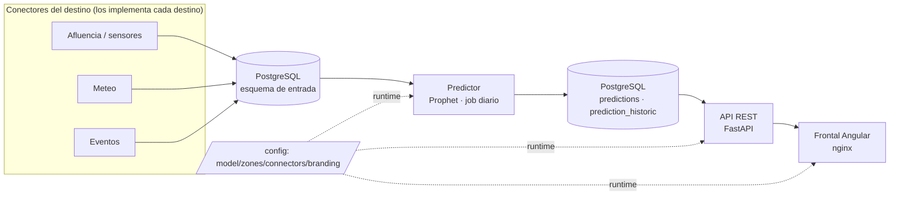
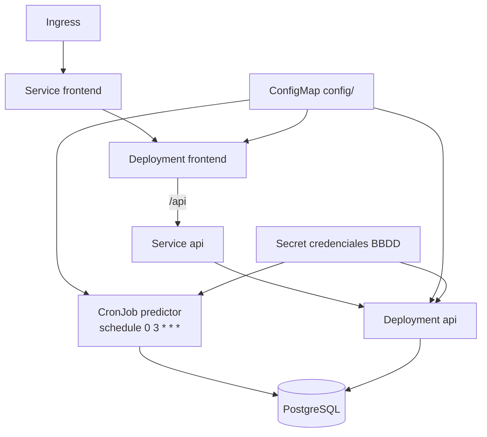

# 02 · Arquitectura de sistemas

## Visión general

## Componentes

| Componente | Tecnología | Función |
|---|---|---|
| **Predictor** | Python 3.11, Prophet 1.1.6 | Entrena por zona y predice la ventana `[hoy, hoy+PRED_DIAS]`. Escribe en las tablas de salida. |
| **API** | FastAPI + Uvicorn | Sirve `zones`, `predictions`, `history`, `branding` al frontal. Solo lectura. |
| **Frontal** | Angular 18 + nginx | Dashboard por zona (histórico vs predicción). Marca en runtime desde `/api/branding`. |
| **BBDD** | PostgreSQL 16 | Entrada (conectores del destino) y salida (resultados del modelo). |
| **Configuración** | ficheros en `config/` | Personalización sin recompilar; montada como volumen (compose) o ConfigMap (k8s). |

## Base de datos PostgreSQL

- **Esquema de entrada** (`connectors.json → input_schema`, por defecto `silver_tourism`):
  tablas de afluencia (`afluencia_visitas`, `afluencia_zonas`), meteo (`meteo`) y
  eventos (`eventos_local`, `eventos_regional`). **Las alimentan los conectores del destino.**
- **Esquema de salida** (`output_schema`):
  - `predictions(timestamp, zone_num, zone_name, visitor_prediction)`
  - `prediction_historic(timestamp, zone_num, zone_name, visitors)`
  - Escritura con **TRUNCATE + append** (no `DROP`), para respetar vistas/matviews dependientes.

## Kubernetes (topología recomendada)

- **CronJob** para el recálculo diario (en vez del bucle del entrypoint).
- **ConfigMap** con `config/` montado en `/config` (backend) y en
  `/usr/share/nginx/html/assets/branding` (frontend).
- **Secret** con `DB_*`.
- **PVC** para PostgreSQL si es autogestionado.
